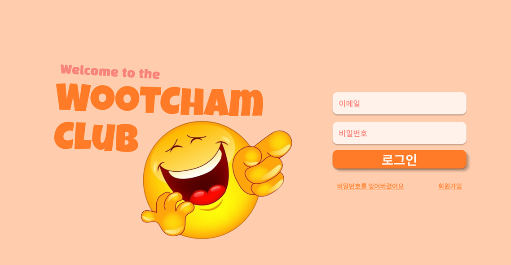
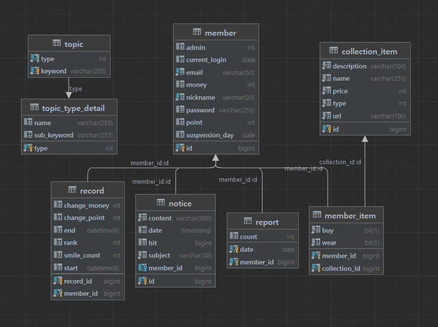
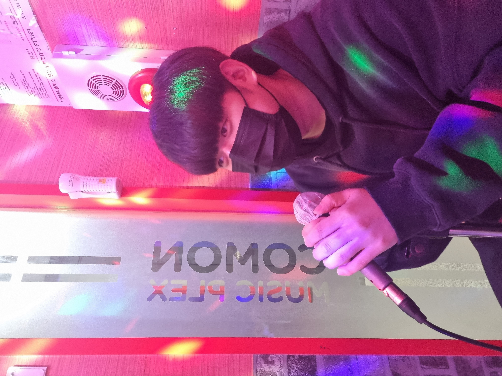
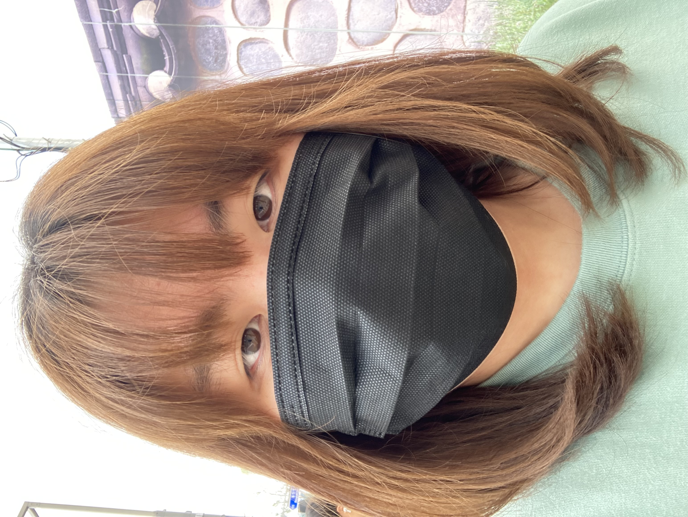
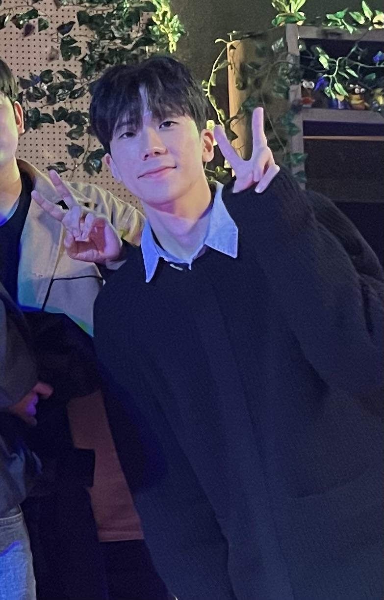
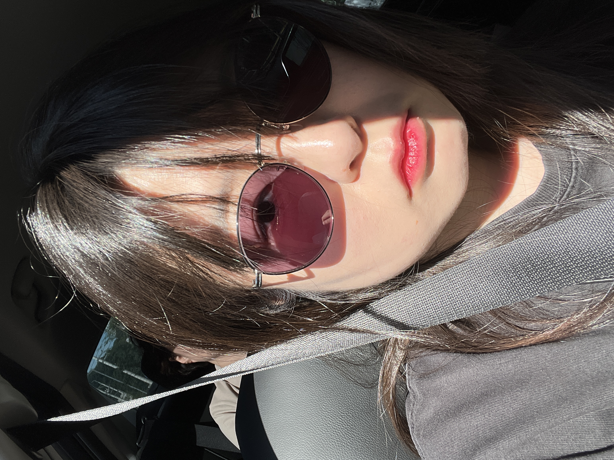
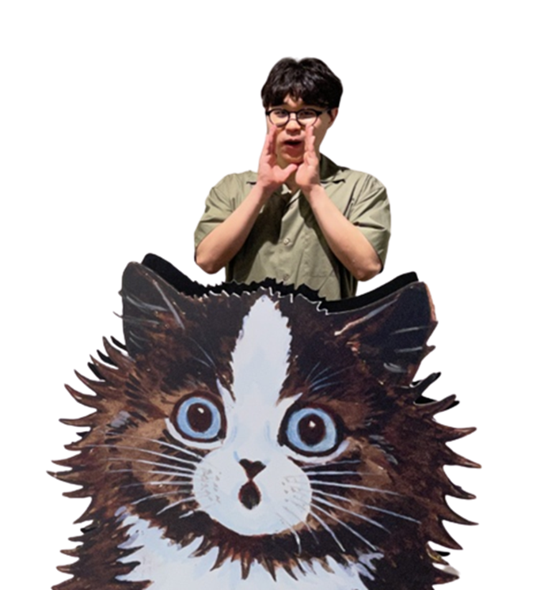

# 😄Woot Cham Club

## 🖥️ 1. 프로젝트 소개
OpenVidu와 faceAPI를 이용하여 화상채팅을 통해 게임을 진행하고, 웃은 횟수에 따라 점수를 부여해 서로 경쟁하는 게임 플랫폼입니다.
 

## 🕰️ 2. 개발 기간
* 23.07.10일 - 23.08.18일

## ⚙️ 3. 개발 환경

#### 💻 **IDE**
    - Intellij
    - Visual Studio Code

#### 🔧 **Backend**
    - Springboot 2.7.2
    - Java 11
    - Gradle 8.2.1
    - JPA
    - MySQL 8.1.0
    - Swagger
    - WebSocket

#### 🎨 **Frontend**
    - HTML, CSS
    - JavaScript
    - Vue 3.2.37
    - Node.js 16.16.0

#### 🚀 **배포**
    - AWS EC2
    - Ubuntu 20.04
    - Jenkins
    - Docker 20.10.17

#### 📊 **버전/이슈 관리**
    - Jira
    - GitLab

#### 🛠️ **Tool**
    - Postman
    - Figma

#### 🤝 **협업**
    - Mattermost
    - Notion

## 📐**4. 설계**

### 4-1. ERD

### 4-2. 시스템 아키텍처

## 📌 5. 주요 기능
### **5-0. 게임 룰**
1. 미션 선택 후 해당 미션에 따른 개그 진행

2. 웃을 시 컴포넌트에 이펙트가 발생하며 카운트가 늘어남

3. 발표자는 카운트 되지 않음

4. 입을 가려 인식이 되지 않으면 5초에 1번씩 카운트가 올라감

5.  화면공유를 통해 영상 매체 활용 가능, 채팅 가능

6. 결과가 끝나면 카운트 된 웃음 횟수별로 순위 지정 및 점수 반영

### **5-1. 기본 UI**
#### 회원가입

#### 로그인

#### 로그아웃

#### 홈

#### 공지

#### 도감

#### 랭크

### **5-2. 게임 UI**
#### 게임 실행
1. 매칭

2. 매칭 수락

3. 미션 선택

4. 게임 시작

5. 채팅

6. 다음 순서 대기

7. 게임 결과

## 🧑‍🤝‍🧑 5. 멤버 구성
|                                김석주                                 |                                박예한                                 |                                옥수빈                                 |                                왕준영                                 |                                이주용                                 |                                              임휘진                                              |
|:------------------------------------------------------------------:|:------------------------------------------------------------------:|:------------------------------------------------------------------:|:------------------------------------------------------------------:|:------------------------------------------------------------------:|:---------------------------------------------------------------------------------------------:|
|  |  |  |  |  |  |
|                      Back-end Api Server                       |                   Back-end Infra                     |                           Front-end                            |                      Back-end Game Sever                       |                       Front-end                      |                                    Front-end                                   |

 
